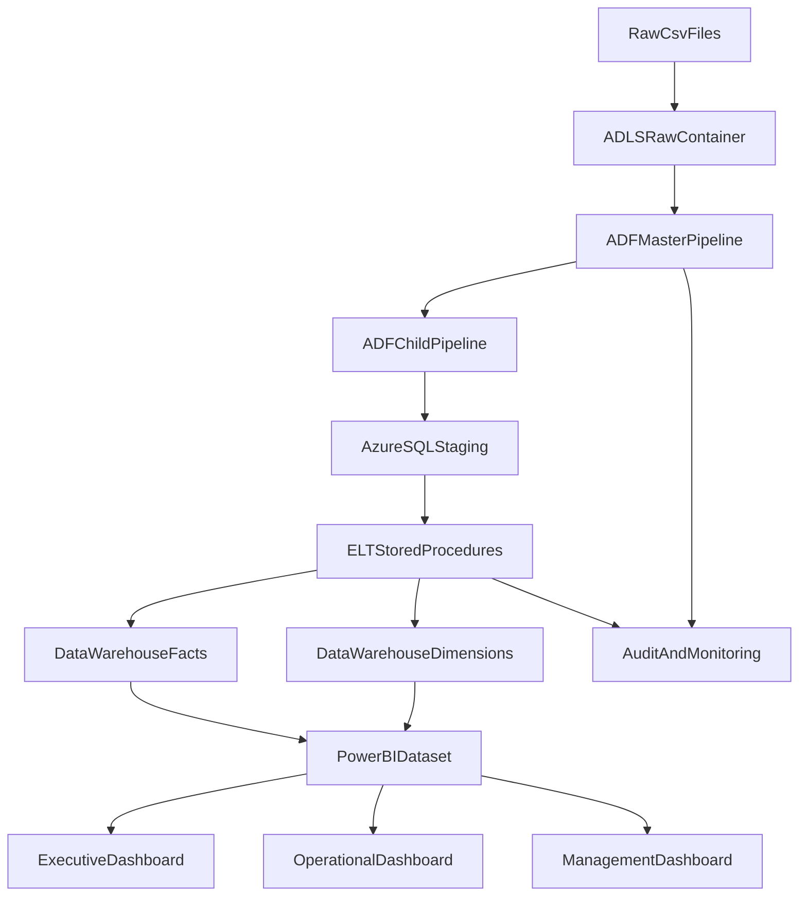

# Architecture Diagram

```mermaid
flowchart TD
srcFiles[RawCsvFiles] --> adlsRaw[ADLSRawContainer]
adlsRaw --> adfMaster[ADFMasterPipeline]
adfMaster --> adfChild[ADFChildPipeline]
adfChild --> sqlStg[AzureSQLStaging]
sqlStg --> spEtl[ELTStoredProcedures]
spEtl --> dwFact[DataWarehouseFacts]
spEtl --> dwDim[DataWarehouseDimensions]
dwFact --> pbi[PowerBIDataset]
dwDim --> pbi
pbi --> execDash[ExecutiveDashboard]
pbi --> opsDash[OperationalDashboard]
pbi --> mgmtDash[ManagementDashboard]
adfMaster --> audit[AuditAndMonitoring]
spEtl --> audit
```
