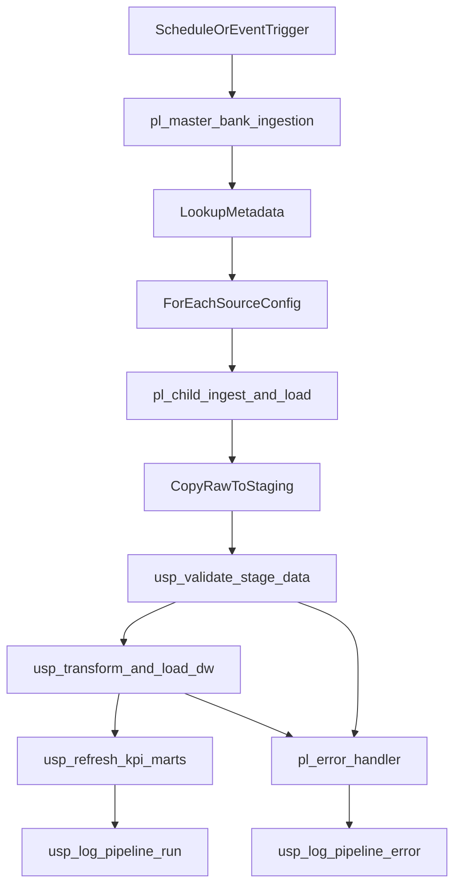

# ADF Pipeline Diagram

```mermaid
flowchart TD
trigger[ScheduleOrEventTrigger] --> master[pl_master_bank_ingestion]
master --> getMeta[LookupMetadata]
getMeta --> foreach[ForEachSourceConfig]
foreach --> child[pl_child_ingest_and_load]
child --> copyRawToSql[CopyRawToStaging]
copyRawToSql --> validate[usp_validate_stage_data]
validate --> transform[usp_transform_and_load_dw]
transform --> kpiRefresh[usp_refresh_kpi_marts]
kpiRefresh --> logSuccess[usp_log_pipeline_run]
validate --> onFail[pl_error_handler]
transform --> onFail
onFail --> logError[usp_log_pipeline_error]
```
