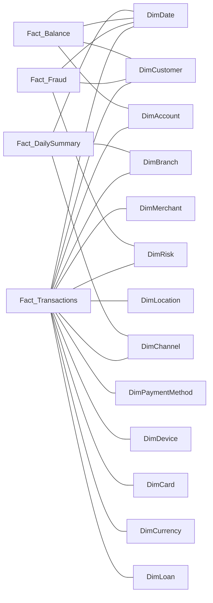

# Star Schema Diagram

```mermaid
flowchart LR
factTxn[Fact_Transactions]
factFraud[Fact_Fraud]
factBal[Fact_Balance]
factDaily[Fact_DailySummary]

dimDate[DimDate]
dimCust[DimCustomer]
dimAcc[DimAccount]
dimMerch[DimMerchant]
dimLoc[DimLocation]
dimBranch[DimBranch]
dimPay[DimPaymentMethod]
dimDevice[DimDevice]
dimCard[DimCard]
dimChannel[DimChannel]
dimCurrency[DimCurrency]
dimRisk[DimRisk]
dimLoan[DimLoan]

factTxn --- dimDate
factTxn --- dimCust
factTxn --- dimAcc
factTxn --- dimMerch
factTxn --- dimLoc
factTxn --- dimBranch
factTxn --- dimPay
factTxn --- dimDevice
factTxn --- dimCard
factTxn --- dimChannel
factTxn --- dimCurrency
factTxn --- dimRisk
factTxn --- dimLoan

factFraud --- dimDate
factFraud --- dimCust
factFraud --- dimRisk

factBal --- dimDate
factBal --- dimAcc
factBal --- dimCust

factDaily --- dimDate
factDaily --- dimBranch
factDaily --- dimChannel
```
